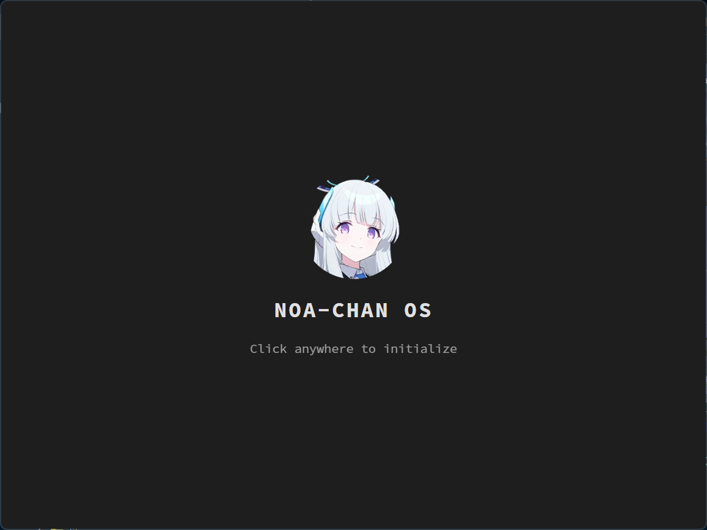
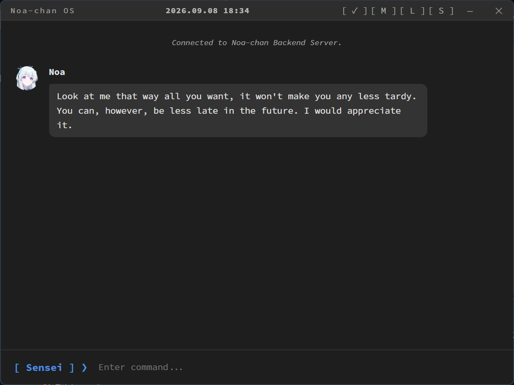

<div align="center">
  <h1>NOA CHAN ASSIST</h1>
  
</div>

<br />

> *"Sensei... you're finally here. Did you need something from me? (* ^ ω ^)"*

---

Yes so basically I like this character and well... I always wanted to make a personal kinda assistant who I could talk to when I'm bored. That's why I made her. 

She's from Blue Archive btw. If you wanna play the game you could click this link ! (・∀・)
[**Play Blue Archive on Steam**](https://store.steampowered.com/app/3557620/Blue_Archive/)

So yeah I made this with the help of AI of course (Yeah I know making an AI thingy with the help of AI is funny but there's that). 

But yeah there's that and here are some screenshots about her (・∀・)

<p align="center">
  
  &nbsp;
  
</p>

Then she's fun to talk to I mean she's not perfect, she sometimes acts dumb, sometimes she doesnt know what she's doing but yeah she's pretty fun to talk to. (≧◡≦)

---

### ✨ Her Capabilities 

and she could do stuffs ! Like actually useful stuffs:
- **Chat & Interactions:** A clean desktop app with notifications and system tray support.
- **Persistent Memory:** She has her own vector memory and long-term brain, plus a core memory to save your preferences and hobbies.
- **Proactive Check-ins:** Randomly reaches out if you've been idle for a while (Proactive mode!).
- **Window & Screen Tracking:** She can read what your active window is, and even take screenshots of your desktop!
- **System Tools:** Execute PowerShell commands, manage git repositories, analyze directories, and check your CPU/RAM health.
- **File Management:** She can read and write local files directly on your computer.
- **Web & Media:** Perform DuckDuckGo web searches, scrape website contents, and even control YouTube to play music or videos for you.
- **Todo List & Timers:** A built-in task manager with due dates, plus you can ask her to set timers to remind you of things.
- **Sandbox Coding:** She can write and securely run Python and JavaScript code inside a sandbox to solve math or analyze data.
- **Fun Stuffs:** Generate massive ASCII art in the terminal, check the local weather, or just play Rock Paper Scissors with you!
- **Model Fallbacks:** Automatically fallbacks to other free OpenRouter models if her main brain goes down.

---

### 💻 The nerdy stuffs (Libraries & Tech) ヾ(・ω・)ノ

In case you're wondering what makes her tick, here's the magic behind the scenes:

<p align="center">
  
  
  
  
  
</p>

- **Tauri & Svelte:** Makes her desktop app super snappy, lightweight, and pretty.
- **Bun:** Used for the backend because we gotta go fast!
- **SQLite (better-sqlite3):** Her local vector memory and long-term brain storage.
- **Orama:** A super fast search engine so she remembers what you said weeks ago.
- **Cheerio & DuckDuckGo Scrape:** So she can actually read the internet when you ask her to look stuffs up!
- **OpenRouter API:** Connects her to all the big smart AI models.

---

### 📖 Setup Tutorial 

If you're interested to try, you can clone the repo and... well you'll need an API key as well, I used openrouter's. Here's a tutorial for it ヽ(・∀・)ﾉ : 

#### 1. What you need to install first:
- [Bun](https://bun.sh/) (for running the backend)
- [Node.js](https://nodejs.org/)
- [Rust](https://www.rust-lang.org/tools/install) (needed to compile the desktop window thingy)
- **C++ Build Tools** (If you're on Windows, just install Visual Studio with the "Desktop development with C++" workload)

#### 2. Getting her on your PC
Just clone it somewhere on your drive:
```sh
git clone https://github.com/rwbu69/noachanassist.git
cd noachanassist
```

#### 3. Installing all the stuffs
You have to install the backend stuff and then the frontend stuff:
```sh
# Root backend stuff
bun install

# Frontend desktop stuff
cd desktop-app
bun install
cd ..
```

#### 4. Waking her up
Now you just compile and run her in dev mode:
```sh
bun run dev
```

#### 5. Settings
When the app opens up for the first time, click the Settings menu and paste in your [OpenRouter API Key](https://openrouter.ai/). You can also change your name, city, and how often she proactively messages you there. Hit save and she'll boot up! 

---

Have fun with her ! (ﾉ´ヮ`)ﾉ*: ･ﾟ
